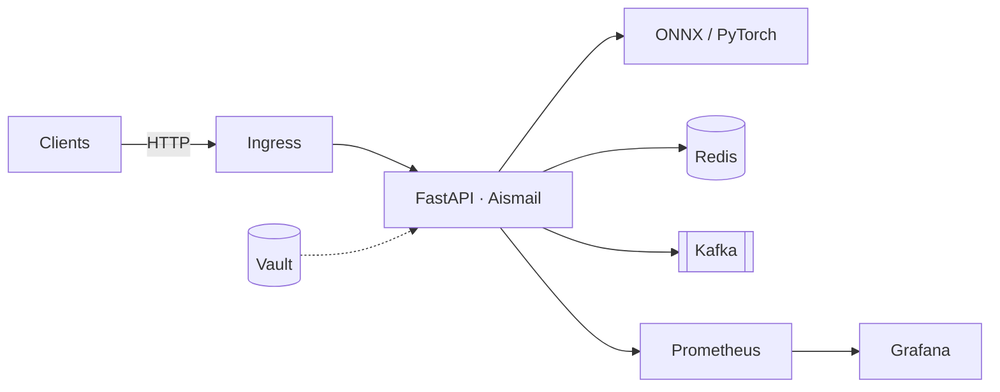

# KubeSense

### by Aismail

Production MLOps sentiment API — DistilBERT on FastAPI, ready for Kubernetes.

[](https://github.com/ismailubts/KubeSense/actions)
[](https://github.com/ismailubts/KubeSense/releases)
[](LICENSE)
[](https://www.python.org/)
[](mailto:aismail@7kingscode.com)

**Author:** [Aismail](https://github.com/ismailubts) · **Email:** [aismail@7kingscode.com](mailto:aismail@7kingscode.com) · **Repo:** [github.com/ismailubts/KubeSense](https://github.com/ismailubts/KubeSense)

---

## Why this project

KubeSense is a cloud-native microservice for real-time and batch sentiment inference. It ships with ONNX-optimized models, Redis caching, Kafka async paths, Helm charts, Terraform modules, and a full observability stack (Prometheus, Grafana, OpenTelemetry).

| Layer | What ships |
|-------|------------|
| Inference | PyTorch (dev) · ONNX Runtime (prod) · optional GPU |
| API | Versioned REST · OpenAPI / Swagger in debug mode |
| Scale | HPA Helm chart · async batch · Kafka consumers |
| Ops | Vault · Terraform · chaos & benchmark suites |
| Quality | Tests · pre-commit · structured logging |

---

## Architecture



More detail: [Architecture](docs/architecture.md) · [ADRs](docs/architecture/decisions/)

---

## Quick start

**Needs:** Python 3.11+, Docker Compose (optional: kubectl, Helm, make)

```bash
git clone https://github.com/ismailubts/KubeSense.git
cd KubeSense

python -m venv .venv
# Windows: .venv\Scripts\activate
source .venv/bin/activate

make install-dev
```

**Docker:**

```bash
docker-compose up --build
```

**Local uvicorn (mock model):**

```bash
# PowerShell
$env:MLOPS_PROFILE="local"
uvicorn app.main:app --reload --host 0.0.0.0 --port 8000
```

**Sample call** (local/debug omits `/api/v1`):

```bash
curl -X POST "http://localhost:8000/predict" \
  -H "Content-Type: application/json" \
  -d "{\"text\": \"This product exceeded my expectations!\"}"
```

```json
{
  "label": "POSITIVE",
  "score": 0.9998,
  "inference_time_ms": 45.2,
  "model_name": "distilbert-base-uncased-finetuned-sst-2-english",
  "backend": "mock",
  "cached": false
}
```

Docs UI: http://localhost:8000/docs

---

## API

| Method | Path | Purpose |
|--------|------|---------|
| `POST` | `/api/v1/predict` | Real-time sentiment |
| `POST` | `/api/v1/batch/predict` | Async batch submit |
| `GET` | `/api/v1/batch/status/{job_id}` | Batch status |
| `GET` | `/api/v1/batch/results/{job_id}` | Batch results |
| `GET` | `/api/v1/health` | Health |
| `GET` | `/api/v1/metrics` | Prometheus metrics |
| `GET` | `/api/v1/model-info` | Model metadata |

---

## Configuration

Profiles (ADR-009): `local` → `development` → `staging` → `production`.  
Priority: profile defaults → `.env` → environment variables → Vault.

```bash
export MLOPS_PROFILE=development
export MLOPS_REDIS_ENABLED=true
```

See [Configuration quick start](docs/configuration/QUICK_START.md) and [Environment variables](docs/configuration/ENVIRONMENT_VARIABLES.md).

---

## Deploy on Kubernetes

```bash
helm upgrade --install mlops-sentiment ./helm/mlops-sentiment \
  --namespace mlops-sentiment \
  --create-namespace \
  --values ./helm/mlops-sentiment/values-production.yaml \
  --set image.repository=aismail/mlops-sentiment \
  --set image.tag=latest
```

Full guide: [docs/setup/QUICKSTART.md](docs/setup/QUICKSTART.md)

---

## Benchmarks & chaos

- `benchmarking/` — [benchmarking/README.md](benchmarking/README.md)
- `make chaos-test-suite` — [chaos/README.md](chaos/README.md)

---

## Contributing

Read [CONTRIBUTING.md](CONTRIBUTING.md). Use Conventional Commits; run `make lint` and `make test` before opening a PR.

**Maintainer:** Aismail · [aismail@7kingscode.com](mailto:aismail@7kingscode.com)

---

## License

MIT — [LICENSE](LICENSE)

Copyright (c) 2025–2026 **Aismail**.
