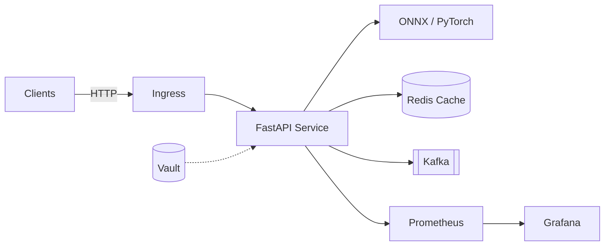

# KubeSentiment

**Cloud-native sentiment analysis for Kubernetes**

[](https://github.com/aismail/KubeSentiment/actions)
[](https://github.com/aismail/KubeSentiment/releases)
[](LICENSE)
[](https://www.python.org/)
[](https://fastapi.tiangolo.com/)

Maintained by **Aismail** · [aismail@7kingscode.com](mailto:aismail@7kingscode.com) · [GitHub](https://github.com/aismail/KubeSentiment)

KubeSentiment is a production-oriented MLOps microservice that serves DistilBERT-based sentiment inference through FastAPI. It is packaged for Kubernetes (Helm), ships with Redis caching and Kafka batch paths, and includes Prometheus/Grafana observability wiring.

---

## What you get

| Area | Capability |
|------|------------|
| Inference | PyTorch (dev) and ONNX Runtime (prod), optional GPU |
| API | Versioned REST (`/api/v1`), OpenAPI docs in debug mode |
| Scale | HPA-ready Helm chart, async batch jobs, Kafka consumers |
| Ops | Vault secrets, Terraform modules, chaos & benchmark suites |
| Quality | Unit/integration tests, pre-commit hooks, structured logs |

---

## Architecture (high level)



Details: [Architecture docs](docs/architecture.md) · [ADRs](docs/architecture/decisions/)

---

## Quick start

### Prerequisites

- Python 3.11+
- Docker & Docker Compose
- Optional: kubectl, Helm 3+, make

### Clone & install

```bash
git clone https://github.com/aismail/KubeSentiment.git
cd KubeSentiment

python -m venv .venv
# Windows: .venv\Scripts\activate
source .venv/bin/activate

make install-dev
# or: pip install -r requirements.txt -r requirements-dev.txt -r requirements-test.txt
```

### Run locally (Docker)

```bash
docker-compose up --build
```

### Run with uvicorn (mock-friendly local profile)

```bash
# Windows PowerShell
$env:MLOPS_PROFILE="local"
uvicorn app.main:app --reload --host 0.0.0.0 --port 8000
```

### Try a prediction

In debug/local mode the `/api/v1` prefix is omitted:

```bash
curl -X POST "http://localhost:8000/predict" \
  -H "Content-Type: application/json" \
  -d "{\"text\": \"This product exceeded my expectations!\"}"
```

Example response:

```json
{
  "label": "POSITIVE",
  "score": 0.9998,
  "inference_time_ms": 45.2,
  "model_name": "distilbert-base-uncased-finetuned-sst-2-english",
  "backend": "mock",
  "cached": false
}
```

Interactive docs (debug mode): http://localhost:8000/docs

---

## API surface

| Method | Path | Purpose |
|--------|------|---------|
| `POST` | `/api/v1/predict` | Real-time sentiment |
| `POST` | `/api/v1/batch/predict` | Async batch submit |
| `GET` | `/api/v1/batch/status/{job_id}` | Batch status |
| `GET` | `/api/v1/batch/results/{job_id}` | Batch results |
| `GET` | `/api/v1/health` | Health |
| `GET` | `/api/v1/metrics` | Prometheus metrics |
| `GET` | `/api/v1/model-info` | Model metadata |

---

## Configuration

Profile-based settings (ADR-009). Priority: profile defaults → `.env` → env vars → Vault.

```bash
export MLOPS_PROFILE=development   # local | development | staging | production
export MLOPS_REDIS_ENABLED=true
```

Guides: [Configuration quick start](docs/configuration/QUICK_START.md) · [Env reference](docs/configuration/ENVIRONMENT_VARIABLES.md)

---

## Kubernetes

```bash
helm upgrade --install mlops-sentiment ./helm/mlops-sentiment \
  --namespace mlops-sentiment \
  --create-namespace \
  --values ./helm/mlops-sentiment/values-production.yaml \
  --set image.repository=aismail/mlops-sentiment \
  --set image.tag=latest
```

Full stack quickstart: [docs/setup/QUICKSTART.md](docs/setup/QUICKSTART.md)

---

## Benchmarks & chaos

- Benchmarking suite: `benchmarking/` — see [benchmarking/README.md](benchmarking/README.md)
- Chaos experiments: `make chaos-test-suite` — see [chaos/README.md](chaos/README.md)

Synthetic Kafka consumer snapshot (in-repo MockModel): ~105,700 msg/s for 1,000 messages.

---

## Contributing

See [CONTRIBUTING.md](CONTRIBUTING.md) for setup, linting (`make lint`), and PR conventions (Conventional Commits).

Questions or issues: **aismail@7kingscode.com**

---

## License

MIT — see [LICENSE](LICENSE).

Copyright (c) 2025–2026 Aismail.
